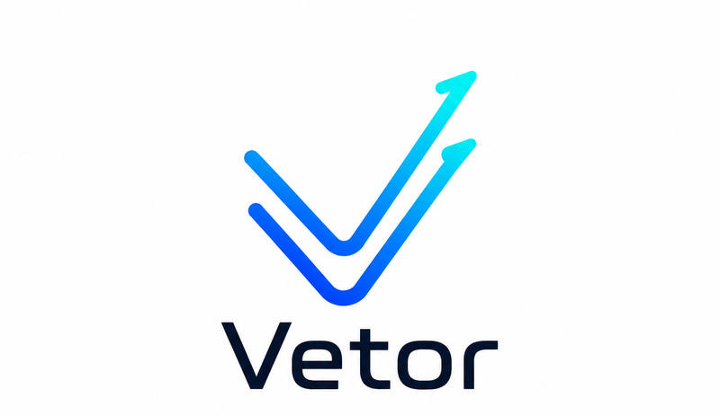

# Vetor

<div align="center">
  <picture>
    <source media="(prefers-color-scheme: dark)" srcset="assets/logo-dark.png">
    
  </picture>
</div>

Plugin de skills para automação de workflow de desenvolvimento — nativo do Claude Code, com compatibilidade parcial documentada para Antigravity, OpenAI Codex, OpenCode e Cursor (ver [Compatibilidade](wiki/Home.md#compatibilidade-com-outros-runtimes)). Distribuído como plugin do Claude Code e como instalador via npm (`@tavaressan/vetor`). **Agnóstico a projeto** — instale uma vez e use em qualquer repositório.

Cobre o ciclo completo: **ideação → backlog → worktree isolado → fix autônomo → ship → guarda**.

## Instalação

**Via plugin do Claude Code** (comandos nativos do Claude Code, não funcionam em outros terminais):

```
/plugin marketplace add Tavaressan/Vetor
/plugin install vetor@vetor
```

**Via npm** (CLI multi-engine — Claude Code, Codex e outras engines suportadas):

```
npm install -g @tavaressan/vetor
vetor install
```

Depois de qualquer uma das duas, rode **`/vetor`** no projeto-alvo: ele detecta o runtime, gera o mapeamento de testes e grava a configuração em `.claude/vetor/`.

**Pré-requisitos:** [Deno](https://deno.com) e `gh` CLI autenticado no PATH, e Git com suporte a `git worktree`. *(Opcionais: `npx` para o MCP `chrome-devtools`, Docker com plugin `docker mcp` para o MCP `docker`, `agy`/`opencode`/`codex` para delegação agnóstica de runtime — ver `delegate-to-runtime.md`.)*

## Skills

| Comando | O que faz |
|---------|----------|
| `/vetor [--force]` | Porta de entrada — inicializa e configura o Vetor no projeto-alvo |
| `/vetor:spec [tema]` | Descobre contexto do projeto (filesystem) e rascunha uma Spec estruturada a partir de um tema |
| `/vetor:spec-validate <path>` | Valida a qualidade de uma Spec (RF/RNF, Acceptance Criteria, Non-Goals) e reporta um score 0-100 |
| `/vetor:backlog-ideator [tema]` | Ideação guiada por docs do projeto → batch de issues GitHub com aprovação humana |
| `/vetor:issue-coordinator [label] [--headless]` | Despacho paralelo de issues para sub-agentes isolados, com merge serializado |
| `/vetor:worktree-create <type> <slug> [issue#]` | Cria worktree isolado, headless |
| `/vetor:fix-loop-agent <descrição>` | Loop autônomo reproduce → fix → rebuild → test (máx. 5 iterações) |
| `/vetor:worktree-ship [issue#]` | Pipeline: test → push → PR draft → CI → code review → merge → cleanup |
| `/vetor:guardian [--cron]` | Audit + auto-fix de gaps que o pre-commit não cobre |
| `/vetor:architecture-review [foco]` | Survey de dívida arquitetural via deletion test — sempre manual, nunca `--cron` |
| `/vetor:design [<diretório>]` | Modo de operação de design, Design Contract e self-correction loop de frontend |
| `/vetor:stack-practices [--refresh]` | Gera regras de melhores práticas por stack detectada, via Context7 |
| `/vetor:retro` | Avalia o uso do Vetor na sessão e propõe melhorias no próprio plugin |

## Início rápido

**Automatizado** — do backlog ao merge:

```
/vetor:backlog-ideator resiliência       # cria issues com label ai-generated
/vetor:issue-coordinator ai-generated    # despacha, implementa, testa, faz PR e merge
/vetor:guardian                          # audita o estado pós-merge
```

**Manual** — uma issue por vez:

```
/vetor:worktree-create fix auth-bug 42
# (desenvolve normalmente)
/vetor:fix-loop-agent testes falhando
/vetor:worktree-ship 42
```

> Para rodar o `/vetor:issue-coordinator` com dispatch em background é preciso o modo de permissões autônomo — ver [Configuração › Permissões](wiki/Configuracao.md#permissões).

## Documentação

A [**wiki**](wiki/Home.md) tem o detalhe:

| Página | Conteúdo |
|--------|----------|
| [Configuração](wiki/Configuracao.md) | Testes por projeto, permissões, delegação ao Gemini |
| [MCPs](wiki/MCPs.md) | `context7`, `chrome-devtools` e `docker` embarcados |
| [Arquitetura](wiki/Arquitetura.md) | Composição das skills, subagentes nativos, observabilidade |
| [Hooks](wiki/Hooks.md) | O que é aplicado por hook, não por prompt |
| [Decisões de design](wiki/Decisoes-de-Design.md) | Trade-offs e limitações conhecidas |
| [Referência](wiki/Referencia.md) | Hard caps, custo de tokens, estrutura do repositório |
| [Compatibilidade](wiki/Home.md#compatibilidade-com-outros-runtimes) | Antigravity, OpenAI Codex, OpenCode, Cursor |

## Créditos

O Vetor se inspira em outros projetos de skills/agentes de IA:

- **[Reversa](https://github.com/sandeco/reversa)** — framework de engenharia reversa de especificações; a ideia de orquestrar times de agentes por fase (Discovery → Ideation → ...) espelhando skills em `.claude/skills/` ecoa no pipeline `spec → coordinator → fix-loop → ship → guardian` do Vetor.
- **[Skills do Matt Pocock](https://github.com/mattpocock/skills)** — conjunto de skills reutilizáveis para agentes de código; o `/grill-me` de lá é a inspiração declarada para o "loop de grilling" usado em `/vetor:architecture-review`.

<!-- TODO: adicionar Superpowers (Jesse Vincent/obra?) assim que o link for confirmado pelo usuário -->

## Licença

[MIT](LICENSE) © 2026 Vitor Tavares Chaves.
